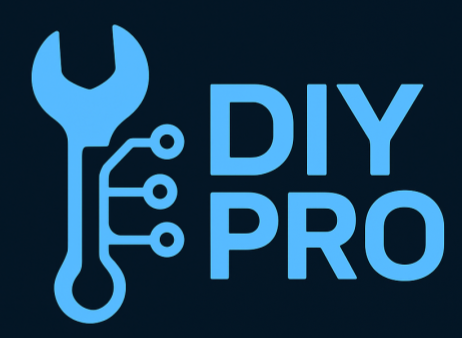

# DIY Pro Extension 

## Human Computer Interaction -- Olin College of Engineering -- Fall '25
### Lily Wei, Trinity Lee, Kelsey McClung, AJ Bulow, Charlie Mawn

# Running The Extension:
- Download this repo to your local device
- Open your chrome extensions tab [chrome://extensions](chrome://extensions) (you might need to type this into a tab yourself, as chrome:// is usually not linkable)
- Turn on developer mode
- Click 'load unpacked'
- Select the this downloaded directory to load
- Open the extension by opening your extensions menu, and selecting the DIY Pro extension

# Running The Website
- Run `pip install django` to install the django web framework
- After installing, `cd` into the `diy_pro_website` directory
- Once inside `diy_pro_website`, run `python manage.py runserver`. This will start up a local server.
- With the local server running, all buttons on the extension will correctly redirect to our website. If this isn't running, redirects to the website will show errors.
- Once finished, use `ctrl + c` to close the local server. Note: this is needs to be running 

# Tasks
- **Simple**: Image search. Use the DIY Pro extension to screenshot an image, search, and view closest matches.
- **Medium**: View purchasing options. After selecting the closest match, a list of tool purchase options will pop up with links too eBay pages. A list of expert repairers with skill sets around the tool also pops up with links to their profiles.
- **Complex**: Self Register themselves to be expert repairers. This means when people search for a tool, if someone registered themselves as an expert repairer, then people can see that they are someone that they can reach out for help

# Limitations
## Wizard-of-Oz & Hardcoded Limitations
Currently our prototype has the image search hardcoded. There is no AI analyzing the image and the image search results are fixed two five hard coded tools. The users in our database are also hardcoded. They are not real users and are randomly generated. Our tool tags for the users are also hardcoded too. Aside from those two, everything has been programmed to be functional. Our purchase tools page uses a script to scrape eBay for tools and our signup for users registers new users to our database. 

## Other Limitations
Some limitations are that the current second iteration is still in progress and has some limited functionality due to the updated changes from the feedback. Our database for our complex task is also hard-coded/ignored as scaling questions are not addressed in the medium fidelity prototype.

